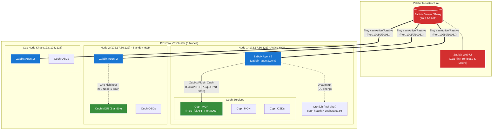

# Tự Động Hóa Giám Sát Ceph trên Proxmox với Zabbix

Dự án này cung cấp một kịch bản (shell script) giúp triển khai tự động cấu hình giám sát **Ceph Cluster** (trên nền tảng Proxmox) bằng **Zabbix Agent 2**. Hệ thống sử dụng Zabbix Agent kết hợp với module **Ceph RESTful API** để lấy dữ liệu sức khoẻ và hiệu năng (OSD, Pool, IOPS...).

---

## Sơ Đồ Kiến Trúc

Dưới đây là sơ đồ kiến trúc tổng thể mô tả luồng dữ liệu giám sát đi từ hạ tầng Ceph lên tới Zabbix Server.



---

## Hướng Dẫn Sử Dụng

### Bước 1: Chuẩn bị
Tải script về một máy tính hoặc máy chủ bất kỳ có thể SSH được vào các node Proxmox:
```bash
git clone https://github.com/fixnhanh-linux/huong-dan-monitor-ceph-proxmox-zabbix.git
cd huong-dan-monitor-ceph-proxmox-zabbix/script-monitor-ceph-proxmox-zabbix
chmod +x setup_ceph_monitor.sh
```

### Bước 2: Chạy Script
Chạy tập lệnh dưới quyền root (hoặc sudo):
```bash
./setup_ceph_monitor.sh
```

Trong quá trình chạy, hệ thống sẽ hỏi bạn 3 thông tin cơ bản:
1. **IP của Zabbix Server:** (VD: `10.8.10.201`)
2. **Danh sách IP các node Proxmox:** Copy toàn bộ IP và dán vào, ngăn cách bằng dấu cách (VD: `172.17.66.121 172.17.66.122 172.17.66.123 172.17.66.124 172.17.66.125`).
3. **Mật khẩu Root Proxmox:** Gõ mật khẩu SSH (chỉ hỏi 1 lần duy nhất, script sử dụng `sshpass` để tự động hóa các bước còn lại).

### Bước 3: Đưa cấu hình lên Zabbix Web
Sau khi script hoàn thành, bạn sẽ nhận được một bảng thông báo cuối cùng:

```text
********************************************************************
           THONG TIN DE CAU HINH TREN GIAO DIEN ZABBIX WEB
********************************************************************
1. Macro {$CEPH.API.KEY} = fa3d09f9-da9f-49f2-8d06-ad35536be0bf
2. Macro {$CEPH.USER}    = zabbix-monitor
3. Macro {$CEPH.API.URL} = https://172.17.66.121:8003
********************************************************************
```

1. Đăng nhập vào giao diện Web Zabbix.
2. Vào **Data collection** -> **Hosts** -> Chọn (hoặc tạo) Host của bạn.
3. Ở phần **Templates**, tìm và gán template: `Ceph by Zabbix agent 2`.
4. Chuyển sang thẻ **Macros**, chọn *Inherited and host macros* và cập nhật 3 Macro tương ứng với 3 giá trị trên màn hình.
5. Bấm **Update**.

*Chờ khoảng 2 - 5 phút và kiểm tra mục **Latest Data** để xem các luồng chỉ số của Ceph đổ về.*
