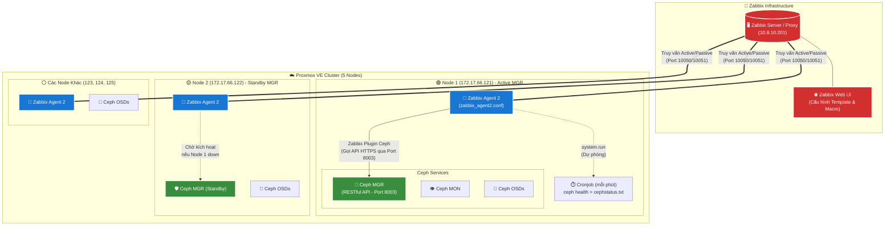

# Sơ Đồ Kiến Trúc Giám Sát Ceph Cluster Trên Proxmox Bằng Zabbix

Dưới đây là sơ đồ kiến trúc tổng thể (Full Architecture) mô tả cách dữ liệu giám sát đi từ hạ tầng Ceph lên tới Zabbix Server. Github hỗ trợ hiển thị trực tiếp sơ đồ này.

### 🔍 Giải thích luồng hoạt động (Data Flow):
1. **Zabbix Server** giao tiếp với **Zabbix Agent 2** (được cài đặt trên tất cả các node Proxmox) qua port `10050/10051`.
2. Trên **Node đang giữ quyền Active Ceph Manager** (ở ví dụ trên là Node 1), module `Ceph RESTful API` được mở ở port `8003`.
3. **Zabbix Agent 2** sử dụng Plugin tích hợp sẵn (được cấp quyền qua API Key `zabbix-monitor`) để gọi HTTP/REST trực tiếp vào port `8003` lấy toàn bộ thông số cluster (OSD, Pool, IOPS, Latency...).
4. Dữ liệu được trả về Zabbix Agent 2 và đẩy thẳng lên **Zabbix Server**.
5. Trong trường hợp API lỗi, **Cronjob** dự phòng sẽ tự động chạy lệnh `ceph health` ghi ra file `/etc/zabbix/cephstatus.txt`, và Zabbix Agent 2 sẽ đọc file này thông qua khoá `system.run` (để lấy log text cơ bản).

Khi **Node 1** chết, Ceph sẽ tự động Promote (đẩy) Manager của **Node 2** lên làm Active. Lúc này Zabbix Agent 2 trên Node 2 sẽ lập tức tiếp quản việc gọi API qua port 8003 của chính nó, giúp việc giám sát không bao giờ bị gián đoạn (High Availability).
